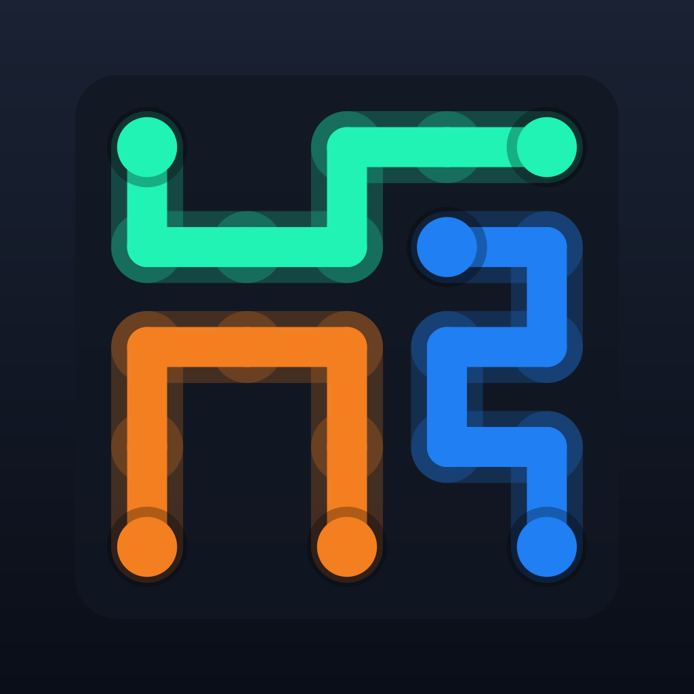

# Line Flow SW

A hybrid-casual flow puzzle for iOS, free to play, monetised with ads, one-off
purchases and a monthly subscription.

Connect every pair of coloured dots with an unbroken line and leave no square
empty. One finger, no timer pressure, thirty seconds a board — and it never
runs out, because there are no level files: **every board is generated on the
device from its level number**.

<p align="center">
  
</p>

---

## Why generated levels

A puzzle game usually ships hand-authored levels, and the content budget then
caps the campaign. Line Flow SW builds each board by *construction* instead: the
playable cells are partitioned into vertex-disjoint simple paths, and the player
is handed only the two ends of each path. Because the partition already covers
the board, a full-coverage solution provably exists — the generator just built
one. No solver runs at runtime, and an unsolvable level cannot ship.

Generation is seeded and deterministic, so level 137 is the same board on every
device and in every future build, without a single byte of level data.

`tools/generator_reference.py` is a line-for-line Python twin of the Swift
generator, used to validate the algorithm end to end: **800 levels across both
tracks, zero invalid boards, worst colour-length imbalance 1.9x**.

## Business model

| | Free | Remove ads (one-off) | Line Flow SW Pro (subscription) |
|---|---|---|---|
| Endless free campaign | ✅ | ✅ | ✅ |
| Daily puzzle | ✅ | ✅ | ✅ |
| Ads | interstitial every 3 levels | none | none |
| Pro level track | — | — | ✅ bigger boards, more colours, walls |
| Cosmetics | earn with stars and gems | earn with stars and gems | ✅ the whole catalogue |
| Monthly exclusive drop | — | — | ✅ |
| Hints | earned or bought | earned or bought | ✅ unlimited |
| Gem earn rate | 1x | 1x | 2x |

Game Center adds four leaderboards on top: total stars, furthest level on each
track, and a daily board where everyone races the identical generated puzzle.
Signing in is optional and the game plays the same without it.

Cosmetics bought with money, gems or stars are **owned forever**. The
subscription grants *access* to the rest while it is active; when it lapses,
only what it granted goes away. `docs/MONETIZATION.md` has the full model, the
ad pacing rules and how to wire a real ad network.

## Getting started

Requirements: **Xcode 16 or newer**, iOS 18 deployment target.

```bash
git clone <this repo>
cd Gioco-Puzzle-2
open LineFlow.xcodeproj          # then just run
```

The scheme already points at `Configuration/Products.storekit`, so purchases,
the subscription, the free trial and restore all work in the simulator with no
App Store Connect setup. `docs/APP_STORE_CHECKLIST.md` covers going live.

### Running the checks

```bash
python3 tools/verify.py           # everything that does not need a Mac
cd PuzzleKit && swift test        # the game logic suite
```

`tools/verify.py` validates the generation algorithm, re-derives the cosmetic
palettes and asserts their perceptual separation, checks both languages against
the source in each direction, checks product identifiers across Swift, the
StoreKit configuration and the localisation, and structurally validates the
Xcode project. CI runs the same script on Linux plus the Swift suites on macOS.

## Layout

```
PuzzleKit/              Swift package: all game logic, no UI, no UIKit
  Core/                 seeded RNG, coordinates
  Generation/           the level generator, difficulty curve, validator
  Gameplay/             the drag/win engine, scoring
  Progression/          save file, chapters, daily challenge, streaks
  Economy/              products, entitlements, cosmetics, ad pacing
LineFlow/              the iOS app
  App/                  entry point, service graph, routing
  Features/             board renderer, home, map, shop, paywall, settings
  Services/             StoreKit, ads, persistence, haptics
  DesignSystem/         theme, components, backdrop
  Resources/            asset catalogue, en.lproj, it.lproj
LineFlowTests/         app-layer tests
Configuration/          Products.storekit
tools/                  the validation harnesses and the icon generator
docs/                   design, monetisation, architecture, release checklist
```

`PuzzleKit` is a separate package on purpose: keeping the rules out of the app
target is what makes them testable without a simulator, and it is why the
generation, economy and progression suites run anywhere Swift does.

## Documentation

- [`docs/GAME_DESIGN.md`](docs/GAME_DESIGN.md) — the mechanic, the difficulty curve, the retention loop
- [`docs/MONETIZATION.md`](docs/MONETIZATION.md) — the model, the numbers to tune, wiring an ad network
- [`docs/ARCHITECTURE.md`](docs/ARCHITECTURE.md) — how the code is organised and why
- [`docs/APP_STORE_CHECKLIST.md`](docs/APP_STORE_CHECKLIST.md) — everything to do before submitting

## Before you ship

The repository is complete and runnable, but three things are placeholders that
**must** be replaced — they are listed in full in the release checklist:

1. Your team and bundle identifier (`com.sabettalineflow.app` is a placeholder).
2. Your privacy policy and support URLs in `LineFlow/Services/LegalLinks.swift`.
3. A real ad network behind `AdService`, if you want ad revenue. The shipped
   `SimulatedAdService` renders an in-app placeholder so the project builds and
   the pacing can be felt without linking an SDK.
